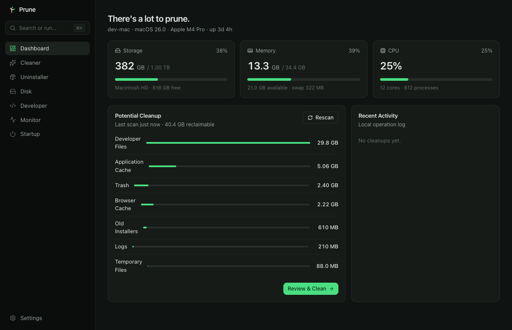
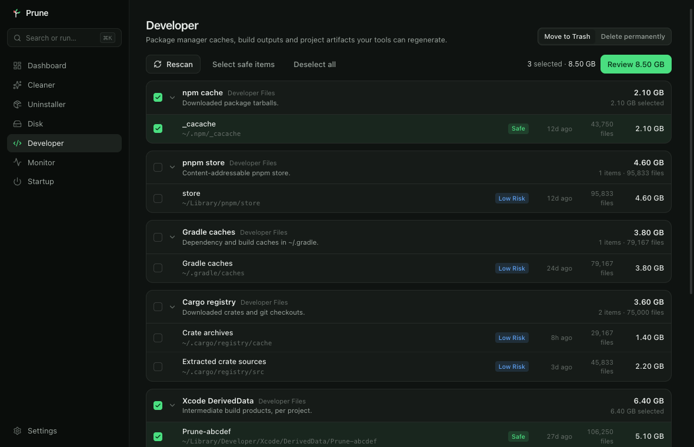
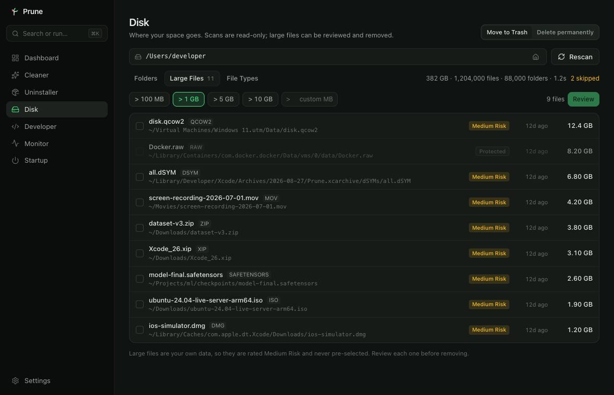
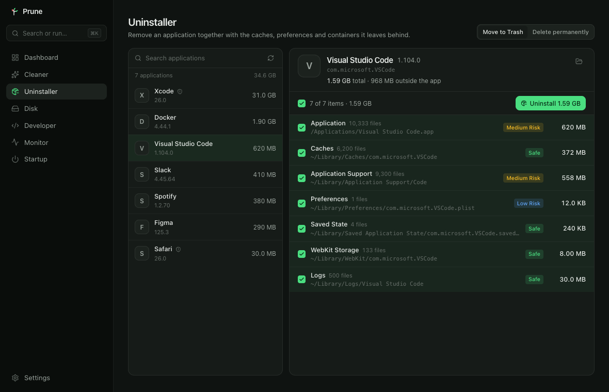
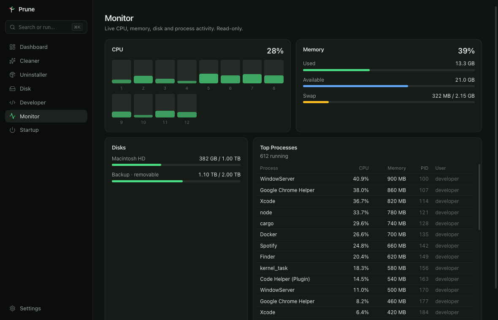

<p align="center">
  
</p>

<h1 align="center">Prune</h1>

<p align="center">
  <strong>Keep what matters. Remove what doesn't.</strong><br />
  An open-source system utility for macOS and Windows.
</p>

<p align="center">
  <a href="https://github.com/bonjin-app/prune/releases">Download</a> ·
  <a href="https://github.com/bonjin-app/prune">GitHub</a> ·
  <a href="docs/ARCHITECTURE.md">Architecture</a> ·
  <a href="CONTRIBUTING.md">Contributing</a>
</p>

<p align="center">
  🧹 Clean &nbsp; 🗑 Uninstall &nbsp; 📊 Analyze &nbsp; 💻 Developer &nbsp; 📈 Monitor &nbsp; ⚡ Startup
</p>

<p align="center">
  <code>100% Local</code> &nbsp; <code>No Account</code> &nbsp; <code>No Telemetry</code> &nbsp; <code>Open Source</code>
</p>

---

## What is Prune?

Prune helps you understand and manage your own computer. Like pruning a tree, it finds the
dead branches — stale caches, temporary files, build leftovers, unused installers — shows you
exactly what they are, and lets **you** decide what to cut. Nothing is ever removed without a
preview and a confirmation.

Prune is not a "one-click cleaner". It is a **developer-first system utility** that treats
safety as the primary feature.

## Why Prune?

- **Developer cleanup as a first-class feature.** Thirty-odd tool caches — npm, pnpm, Yarn, Bun,
  node-gyp, Deno, Playwright, Puppeteer, Cypress, Electron, Gradle, Maven, Cargo, Go, NuGet,
  CocoaPods, Swift Package Manager, pub, RubyGems, Composer, JetBrains, Homebrew, Xcode
  DerivedData and Archives, Simulator caches — plus project artifacts found per project:
  `node_modules`, Rust `target/`, `build/`, `dist/`, Python caches and virtualenvs. Point it
  at the folders where your code actually lives.
- **Safe by default.** A whitelist of removable roots, a list of protected paths, a mandatory
  dry run, Trash before permanent deletion, and a local operation log. See
  [SECURITY.md](SECURITY.md) for the guarantees.
- **Local and private.** No server, no account, no cloud, no telemetry, no network code at all.
- **Native.** Tauri 2 + Rust. Small binary, low memory, fast parallel scans with progress and
  cancellation.
- **Cross-platform.** One UI for macOS and Windows; OS differences live in a small platform layer.

## Features

| Area            | Status     | What it does                                                                     |
| --------------- | ---------- | -------------------------------------------------------------------------------- |
| Dashboard       | ✅         | Storage, memory, CPU at a glance; reclaimable space by category; recent activity |
| Cleaner         | ✅         | Application caches, logs, temporary files, Trash, old installers, browser caches |
| Developer       | ✅         | Global tool caches + project artifact finder with per-item risk levels           |
| Monitor         | ✅         | Live CPU per core, memory, swap, disks, top processes                            |
| Command palette | ✅         | `⌘K` / `Ctrl+K` to jump anywhere or start a scan                                 |
| Disk analyzer   | 🔜 Phase 5 | Directory tree, large file finder, visual usage                                  |
| Uninstaller     | 🔜 Phase 6 | Apps with their caches, preferences, containers                                  |
| Startup manager | 🔜 Phase 7 | Login items and launch agents, enable / disable                                  |
| Docker cleanup  | 🔜         | Images, containers, volumes, build cache                                         |
| CLI             | 🔜         | `prune scan`, `prune clean --developer`, … (read-only prototype available)       |

Every removable item carries a risk level:

```
Safe        regenerated automatically, no user state      browser cache, npm cache, logs
Low Risk    cheap to rebuild                              node_modules, build directories
Medium Risk may hold state you care about                 Xcode archives, virtualenvs
High Risk   shown, never pre-selected
Protected   never removable through Prune
```

## Screenshots

<p align="center">
  
</p>

<table>
  <tr>
    <td width="50%">
      <br />
      <sub><b>Developer</b> — tool caches and project artifacts, each with a risk level</sub>
    </td>
    <td width="50%">
      <br />
      <sub><b>Disk</b> — folder sizes, largest files, file types</sub>
    </td>
  </tr>
  <tr>
    <td width="50%">
      <br />
      <sub><b>Uninstaller</b> — the app plus everything it left behind</sub>
    </td>
    <td width="50%">
      <br />
      <sub><b>Monitor</b> — per-core CPU, memory, disks, processes</sub>
    </td>
  </tr>
</table>

<sub>Captured from `pnpm dev`, which runs the interface against built-in sample data so the
screenshots do not expose a real machine. The numbers shown are made up; everything else is the
real interface.</sub>

## Supported Platforms

| Platform | Architectures        | Minimum               |
| -------- | -------------------- | --------------------- |
| macOS    | Apple Silicon, Intel | macOS 12              |
| Windows  | x64                  | Windows 10 (WebView2) |

## Installation

Pre-built installers (`.dmg`, `.msi`, `.exe`) will be published on
[GitHub Releases](https://github.com/bonjin-app/prune/releases). Homebrew, WinGet and Scoop
are planned.

Until then, build from source (below).

## Development

Prerequisites: Rust stable, Node 20+, pnpm, and the
[Tauri 2 prerequisites](https://tauri.app/start/prerequisites/) for your OS.

```bash
pnpm install
pnpm tauri dev                     # desktop app with hot reload
pnpm dev                           # UI only, in the browser, against a mock backend
cargo run -p prune-cli -- scan     # the command line, same engine
```

Checks:

```bash
pnpm typecheck && pnpm lint && pnpm test
cargo fmt --all --check && cargo clippy --workspace --all-targets -- -D warnings && cargo test --workspace
```

## Command line

The same engine, the same safety rules, in a terminal:

```bash
cargo install --path crates/prune-cli   # installs `prune`

prune status                     # what Prune can see on this machine
prune scan                       # find removable data (read-only)
prune scan --only npm_cache --json | jq '.totalBytes'
prune clean                      # show what would go — a dry run
prune clean --yes                # move safe items to the trash
prune clean --include-low --yes  # also node_modules, build directories, …
prune disk ~/Projects --large 500
prune apps --detail "Visual Studio Code"
prune startup
prune log
```

Two rules keep it safe to type quickly:

- `clean` is a **dry run unless you pass `--yes`**. The default prints the plan and stops.
- `clean` only ever selects `Safe` items on its own, or `Low` as well with `--include-low`.
  Anything riskier is listed by `scan` but can only be chosen item by item in the desktop app,
  where the path and the risk are in front of you.

Exit codes: `0` success, `1` something failed, `2` nothing matched.

## Architecture

```
┌────────────────────────────────────────────┐
│  Prune UI   React · TypeScript · Tailwind  │
└──────────────────────┬─────────────────────┘
                       │  Tauri commands + events (ids only, never paths for deletion)
┌──────────────────────▼─────────────────────┐
│  src-tauri   thin IPC adapter              │
├────────────────────────────────────────────┤
│  prune-core  (pure Rust, no Tauri, no net) │
│   providers → scan → safety → fs → ops     │
│   platform/{macos,windows}   system        │
└──────────────────────┬─────────────────────┘
                 macOS │ Windows
```

Cleanup pipeline:

```
Discovery → Path Validation → Risk Classification → User Confirmation → Dry Run → Delete → Operation Log
```

Details, module map, IPC naming and the provider interface: [docs/ARCHITECTURE.md](docs/ARCHITECTURE.md).

## Security

Prune deletes files, so every bug that could remove the wrong thing is treated as a security
issue. The guarantees and the private reporting process are in [SECURITY.md](SECURITY.md).

## Contributing

Issues and pull requests are welcome — especially new cleanup providers, which are usually a
single declaration. Start with [CONTRIBUTING.md](CONTRIBUTING.md).

## Acknowledgements

Prune was inspired by [Mole](https://github.com/tw93/Mole) and the idea that a cleaner should
be a tool you understand, not a button you trust.

## License

[MIT](LICENSE)
